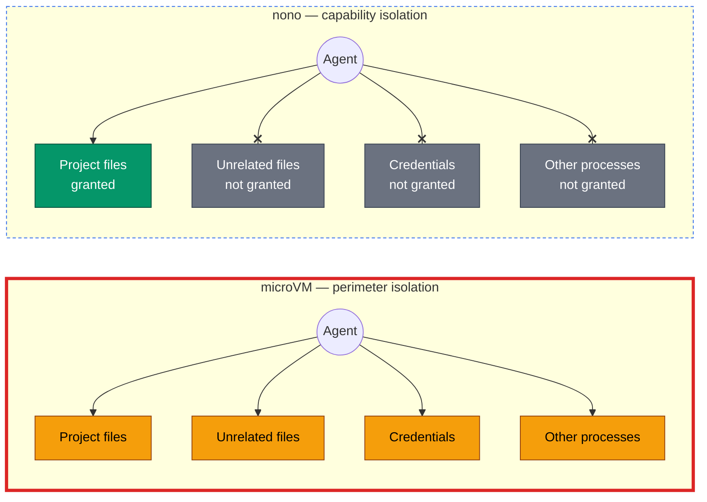

## Sandboxing

Sandboxing is a security technique that runs a workload inside a boundary that limits what it can do and what it can access. Under the term 'Sandbox' there are many different models, everything from a full hypervisor or microVM to a browser tab, process, or even a single function call. The common theme is that the sandboxed process is restricted in what it can do and what it can access.

nono provides fine-grained **capability control** sandboxing, where policy can be enforced down to the level of a single file / folder access, network access, or in some cases specific system call. **This is intentionally a different model from a guest/host isolation boundary sandbox model**. It reduces the authority available to a process and any child process it spawns, but it does not create a separate kernel or hardware boundary. It is a capability model, not a VM model.

That distinction is intentional and important to understand, especially in the context of autonomous agents. An agent needs to use real development tools, reach selected services, and sometimes request additional access. This level of delegation is incompatible with a permanently sealed process model provided by a VM or container and in most cases practically impossible to implement with the level of granularity nono provides.

So a model that promises both an absolute, permanently sealed boundary and fine-grained, runtime delegation would be contradictory.

The security goal is therefore:

> Make each grant of authority explicit, narrow, enforceable, and auditable at the point where a process and its child processes spawn.

nono answers this question "how do I limit the execution path of a single spawned process and its children?" It does not answer "how do I create a separate kernel or single monolithic hardware boundary?" nono provides the former, and it can be combined with the latter when the deployment requires it.

### Policy taxonomy

nono uses three top-level policy categories:

- **Filesystem policy** controls which paths a sandbox can read or write.
- **Network policy** controls network access. Direct network policy governs connections outside the proxy; proxy policy governs proxied domain and endpoint rules plus credential routes.
- **Command policy** controls which commands may run, who may invoke them, and which command sandbox policy an invocation receives.

The initial workload runs in the **session sandbox**. A policy-controlled command runs in a fresh **command sandbox**, whose policy may contain its own filesystem and network policies, environment rules, credentials, and resource limits. A sandbox is the enforced runtime boundary; a policy is the configuration used to build that boundary.

### Capability model vs. isolation model

The perimeter is strong, but once inside it, everything is flat: an agent running in a microVM can freely reach every asset in the box — project files, unrelated files, credentials, other processes — because the guest OS does not itself distinguish between them.

nono does the opposite: it does not add a perimeter around the whole box, but it protects the assets *inside* the agent's own operating context. Each file, credential, and process the agent can reach is the result of an explicit grant; anything not granted stays out of reach even though it runs on the same shared kernel.

## Process Sandboxing and Command Policies

1. The agent invokes a selected command such as `git`, `kubectl`, or `curl`.
2. The shim sends the invocation and caller identity to the trusted supervisor.
3. The supervisor resolves the applicable command or caller-to-command policy.
4. nono launches the tool in a fresh command sandbox containing a minimal runtime baseline plus the selected command sandbox policy's filesystem, network, environment, credential, argument, output, and resource grants.
5. A chained command crosses the broker again and receives its own command sandbox policy.

This makes the **tool invocation** the main capability boundary. A build tool and a deployment tool do not need to share authority merely because the same agent invokes both.

See [Sandboxed Tool Execution](/cli/features/tool-sandbox) for the policy schema and chaining model.

## Trust Boundaries

| Component | Trust assumption | Responsibility |
|---|---|---|
| Host kernel | Trusted | Enforces Landlock, seccomp, and Seatbelt restrictions applied to sandboxed processes. |
| nono supervisor and broker | Trusted | Resolves command policy, launches command sandboxes, mediates approvals, proxy access, credentials, audit recording, and other runtime services. |
| Profile and command policy | Trusted configuration | Defines which commands and invocation paths receive authority. A broad or unsafe policy produces a broad or unsafe sandbox. |
| Selected tool process | Restricted workload | Receives the capabilities in its effective command sandbox and can exercise all of them. It need not cooperate with policy enforcement. |
| Agent and tool inputs | Not trusted to choose policy | May request operations, but do not directly decide which capabilities the broker grants. |
| Container or microVM, when used | Optional outer boundary | Limits the effect of a nono, policy, kernel, or command-mediation bypass. |

The supervisor is deliberately outside the command sandboxes and runs with the invoking user's host permissions. It is part of nono's trusted computing base, not a less-privileged peer of the agent.

Profiles are security-sensitive code. Command resolution, writable executable exceptions, direct-exec bypasses, raw credentials, unsafe Seatbelt rules, broad filesystem grants, and permissive approval rules all change the effective boundary.

## Capability Expansion and Irreversibility

Landlock and Seatbelt restrictions applied to an individual child are not removable by that child. Its descendants inherit those restrictions.

That does **not** make the nono session as a whole irreversible:

- The trusted supervisor remains outside the child's sandbox.
- The supervisor can launch a new command sandbox with the capabilities selected by a command policy.
- On supported Linux systems, explicit capability elevation can let the supervisor open an approved file and inject its file descriptor into a child.
- Brokered network access, credential injection, URL opening, and approval backends intentionally perform operations the child cannot perform directly.

The accurate invariant is: **a sandboxed process cannot expand its own kernel policy; only a trusted component outside that sandbox can delegate additional authority through an enabled, policy-controlled path.**

Runtime delegation is a feature, not an escape. It must still be treated as a security decision because an approval or command policy can give the requesting workload access it did not previously have.

See [Supervisor Mode](/cli/features/supervisor) for capability elevation and [Execution Modes](/cli/features/execution-modes) for the process model.

## Syscall Scope

The seccomp filter traps only `openat` and `openat2`. All other syscalls pass through at full speed with zero overhead.

| Syscall | Trapped | Rationale |
|---------|---------|-----------|
| `openat` / `openat2` | Yes | File access is the capability boundary |
| `read` / `write` / `close` | No | Hot path; operates on already-granted fds |
| `stat` / `access` | No | Information leak, but agents handle failures gracefully; not a data exfiltration vector |
| `unlink` / `rename` | No | Governed by Landlock; cannot affect paths outside the allowed set |
| `connect` / `bind` | No | Governed by Landlock ABI v4+ network filtering; in proxy mode, restricted to localhost proxy port |

The 3-10 microsecond overhead on file opens is negligible for agent workloads. Agents open files infrequently relative to reading and writing them.

### Information leak surface

Because `stat` and `access` are not trapped, the sandboxed child can enumerate filesystem structure — file existence, types, permissions — without triggering a supervisor notification. For cooperative agents (the target use case), this is acceptable. For adversarial code, this could enable reconnaissance. The optional mount namespace layer (when available) would close this gap.

## Failure Modes

| Failure | Behavior | Safety Property |
|---------|----------|-----------------|
| Supervisor crashes | Notif fd closes; pending syscalls get `ENOSYS`; child falls back to Landlock | Safe — Landlock denies the access |
| Supervisor denies request | Child receives `EPERM` | Safe — explicit denial |
| Protected-root match | Request rejected before approval backend is consulted | Safe — protects internal nono state |
| Rate limit exceeded | Request automatically denied | Safe — prevents prompt flooding |
| Child exits during approval | `SECCOMP_IOCTL_NOTIF_ID_VALID` check fails; supervisor discards the request | Safe — no orphaned state |
| Path canonicalization fails | Supervisor returns error to child | Safe — fail-closed |

The invariant is: **if anything goes wrong, the child does not get access**. The system fails closed at every decision point.

## Audit Integrity Limits

The audit subsystem has a narrower security claim than the sandbox itself.

- The supervisor is trusted to record events honestly and completely. The sandboxed child cannot write its own audit log, but the audit log still depends on supervisor correctness.
- Session-local hashes are not, by themselves, sufficient history integrity. nono therefore records audited sessions into a global audit ledger as sessions complete.
- The current ledger is still local host state. Without a future signature or external anchor, a host attacker who can rewrite both the session files and the ledger can forge a self-consistent history.
- For supervised sessions, the supervisor hashes the resolved main executable binary and binds that `{ resolved_path, sha256 }` identity into session metadata and the global audit ledger.
- When `--audit-sign-key` is configured, the supervisor also signs the session's audit Merkle root and session context using a keyed DSSE/in-toto attestation. The signature is written into the session directory and can later be checked with the corresponding public key.
- That signature is produced once, at session finalization. nono does not sign each individual audit event.
- Command arguments in session metadata and signed audit predicates are best-effort redacted before persistence. The redaction list is intentionally conservative for common flag, header, and URL patterns, but it is not a complete secret detector. User config may add local redaction names; removing defaults requires an explicit unsafe redaction override and is recorded as a policy diff in audit data.
- That executable identity is not full runtime provenance. Shared libraries, interpreter chains, scripts passed as arguments, and dynamically loaded runtime dependencies are not covered by that binary hash.
- The executable hash is computed before `exec`, not from the final kernel-loaded file descriptor. A privileged attacker with write access to the executable path could still race between hash and execution.
- The keyed audit attestation is only as strong as the signing key distribution model. If the verifier does not pin the expected public key, a rewritten session could also rewrite the embedded public key and remain self-consistent.
- `nono audit verify --public-key-file <FILE>` is the path that pins verification to an expected signer key. Without that, attestation verification checks the keyed signature against the public key recorded in session metadata.
- Filesystem Merkle roots under `--audit-integrity` or `--rollback` commit tracked writable paths, not the full machine state.
- Session metadata carries a denormalized rollup of command-policy decisions so that session listings do not have to parse event logs. That rollup is derived data, not a second record: it is covered by the session digest committed to the ledger, so editing it fails `nono audit verify`, but it is not independently recomputed from the events during verification. A rollup read without verifying is only as trustworthy as the file it came from, and `nono audit show` is the authoritative per-decision record.

The correct way to read the feature today is:

- sandbox enforcement: kernel-enforced and fail-closed
- audit trail: supervisor-recorded and tamper-evident within the local integrity model
- attestation: keyed signing is available for session audit roots, but external anchoring and timestamping are still future work

## What If the Supervisor Is Compromised?

A reasonable question: the supervisor can open any file and inject it into the child. If an attacker compromises the supervisor, can they use it as a proxy to feed arbitrary files to the sandboxed agent?

The answer depends on where the attacker is.

### From the child (inside the sandbox)

The child cannot compromise the supervisor because the supervisor never runs untrusted code. The agent runs in the child. The supervisor is nono's own Rust binary — the parent process after `fork()`.

The child's communication channels to the supervisor are:

- **seccomp notification fd** — kernel-mediated. The child cannot forge or manipulate these; the kernel generates them from trapped syscalls.
- **Unix socket** — length-prefixed JSON parsed by serde in memory-safe Rust. Malformed messages are rejected. Valid messages are checked against protected roots, rate-limited, and require user approval.

The child cannot `ptrace` the parent (blocked by yama `ptrace_scope` on most distributions, and the child's own seccomp filter restricts its syscalls). There is no shared memory, no signal-based control channel, and no way to inject code into the supervisor process.

Compromising the supervisor from the child would require a memory corruption bug in nono's Rust code (memory-safe by default, no `unsafe` in the IPC path) or a kernel exploit.

### From outside (an external attacker)

The supervisor runs as the same user who invoked `nono run`. It is not setuid, does not run as root, and holds no elevated capabilities. It can only open files the invoking user can already open.

If an external attacker can compromise the supervisor process, they already have user-level code execution on the host. At that point, they can open the same files directly — the supervisor grants them nothing they do not already have. The supervisor is a privilege boundary in the **downward** direction (restricting the child), not the upward direction.

The supervisor's external attack surface is minimal:

| Surface | Exposure |
|---------|----------|
| IPC socket | Anonymous `socketpair()` — no filesystem path, no way for external processes to connect |
| seccomp notif fd | Owned solely by the supervisor; no other process holds it |
| Approval input | Reads from `/dev/tty`; requires access to the user's terminal session |
| Network | Minimal — in proxy mode, the supervisor listens on a random localhost port protected by a session token; otherwise none |

There is no network-exposed surface, no filesystem-visible socket, and no way to interact with the supervisor without already having the user's terminal session or the ability to inject code into the supervisor's address space.

### What if the supervisor has a vulnerability?

Even in an unprivileged supervisor, a memory corruption vulnerability could allow the child to escape the sandbox by hijacking the supervisor's control flow. The question is how realistic this is.

**Rust eliminates the most common vulnerability classes.** Buffer overflows, use-after-free, double-free, and format string attacks are structurally impossible in safe Rust. The compiler prevents them, not programmer discipline. The IPC message parsing uses serde JSON with no manual buffer management — there is no `sprintf` into a stack buffer, no `memcpy` with an attacker-controlled length.

**The `unsafe` surface is small and does not parse complex input.** The `unsafe` blocks in the supervisor path are limited to libc FFI calls: `openat`, `poll`, seccomp ioctls, and `SCM_RIGHTS` fd passing. These are thin wrappers around syscalls with fixed-size arguments, not parsing routines operating on attacker-controlled data.

**The child can only deliver a payload through two narrow channels:**

| Channel | Data Format | Parser |
|---------|-------------|--------|
| Unix socket | Length-prefixed JSON | serde (memory-safe, widely audited) |
| `/proc/CHILD/mem` | Bounded-length path string | `canonicalize` + `openat` (standard libc) |

There is no complex protocol, no nested binary format, and no state machine with edge cases. A serde deserialization vulnerability would be a CVE affecting the entire Rust ecosystem, not a nono-specific bug.

**Even a successful exploit has limited blast radius.** If an attacker chains together a hypothetical memory corruption in an `unsafe` FFI block with a delivery mechanism from the child, they achieve user-level code execution in the supervisor. This is the same privilege level the invoking user already has — the attacker has escaped the sandbox but has not escalated privileges. This is meaningful (a sandbox escape is a real security event) but it is not the catastrophic outcome of compromising a root-level supervisor.

The risk is not zero — nothing is. But Rust's memory safety guarantees make the traditional exploit classes structurally impossible across the vast majority of the codebase, the remaining `unsafe` surface is small and constrained, and the worst-case outcome is lateral movement to the user's own privilege level rather than privilege escalation.

### The key distinction

The supervisor is not a privilege escalation target because it does not hold privileges the user does not already have. This is a deliberate design choice. nono runs entirely unprivileged — no root, no `CAP_SYS_ADMIN`, no setuid. An architecture where the supervisor ran with elevated privileges (as some container runtimes do) would make supervisor compromise a serious escalation vector. nono avoids this by design.

## Network Proxy Security Model

When `--network-profile` or `--allow-domain` is used, nono starts an HTTP proxy in the supervisor process and restricts the child to `ProxyOnly` mode — only `localhost:<port>` is reachable from inside the sandbox.

### Enforcement Layers

| Platform | Mechanism | What It Restricts |
|----------|-----------|-------------------|
| Linux | Landlock ABI v4+ per-port TCP rules | `connect()` limited to proxy port only |
| macOS | Seatbelt `(allow network-outbound (remote tcp "localhost:PORT"))` | All other outbound denied |

The kernel enforcement ensures the child cannot bypass the proxy by connecting directly to upstream hosts, even if it knows the IP address. There is no userspace workaround — `connect()` to any address other than `127.0.0.1:<port>` returns `EPERM`.

### Session Token Authentication

Every proxy session generates a 256-bit random token (via `getrandom`). The child receives it as `NONO_PROXY_TOKEN`. Every request must include this token:

- CONNECT mode: `Proxy-Authorization: Bearer <token>`
- Reverse proxy mode: `X-Nono-Token: <token>`

Tokens are compared using constant-time equality to prevent timing attacks. This prevents other localhost processes from using the proxy even if they discover the port number.

### DNS Rebinding Protection

The proxy resolves DNS itself and checks all resolved IP addresses against the link-local range before connecting. This prevents attacks where:

1. An attacker controls DNS for an allowed hostname
2. DNS returns a link-local address (e.g., `169.254.169.254`)
3. The proxy would connect to the cloud metadata service thinking it's an allowed external API

Link-local IPs (169.254.0.0/16, fe80::/10) are always blocked after DNS resolution. Cloud metadata hostnames are also hardcoded as denied. Private network addresses (RFC1918) are allowed to support enterprise environments.

### Credential Isolation

In reverse proxy mode, API credentials are loaded from the system keyring at proxy startup and stored in the supervisor's memory as `Zeroizing<String>`. They are never passed to the sandboxed child:

- The child sees `OPENAI_BASE_URL=http://127.0.0.1:<port>/openai` — a local HTTP URL with no key
- The proxy injects `Authorization: Bearer sk-...` when forwarding to the upstream over TLS
- The child cannot read the credential from the proxy's memory (separate process, no shared memory, no `ptrace`)

If the child's traffic is captured (e.g., by a rogue library logging HTTP requests), only the local proxy URL is visible. The real API key never appears in the child's address space.

### PATH Sanitization for Host-Side Brokers

Several credential paths run a helper CLI host-side, unsandboxed, resolved by bare name via `PATH` — `op`/`bw`/`security` for keystore-backed credentials, the `command`/`source.command` fields on ambient and `credential_capture` credentials, `open`/`xdg-open` for browser-open requests, and `git` for `@git:*` dynamic profile tokens (`@git:config-files`, `@git:hooks-path`). Because these helpers run outside the sandbox with the real user's privileges, a directory on `PATH` that the sandbox has write access to (a workdir, a cache directory, anything under `filesystem.allow`) is a planting ground: if that directory is also on the ambient `PATH` — common in practice, e.g. `$HOME/go/bin` — the sandboxed child could write a same-named binary there and have it run host-side instead of the real one.

Before any of these lookups, nono strips every `PATH` entry that isn't provably read-only to the sandbox's capability set — checking the entry itself, its parent, and each hop of its symlink chain (a writable parent lets the sandbox swap out a symlink regardless of where it currently points). Since the exact binary name being resolved is always known ahead of time, the check also covers write grants scoped to that one file rather than its containing directory (e.g. `filesystem.write: ["/usr/local/bin/gh"]`) — a directory-only check would miss this, since the directory itself carries no grant. An entry that can't be proven safe (unresolvable, a symlink cycle, empty/relative) is dropped rather than kept. This applies independently of whether the sandboxed session has actually run yet: the check is against the capability set the profile grants, not against runtime state, so it also covers the case of a directory poisoned by an earlier session sharing the same profile.

`@git:*` tokens are the one exception to "the full capability set": they resolve while the profile's `filesystem.allow`/`read`/`write` lists are still being assembled entry by entry, so a token only sees grants that appear *earlier in the same list* — a policy-group grant, or a literal path listed before the token in that same `filesystem.allow`/`read`/`write` array. It does not see grants from a CLI `--allow`/`--write`/`--read` flag (always applied after these profile fields finish processing) or from an entry later in the same list. In practice this means a `@git:*` token protected only by a CLI flag, or listed before the profile entry that would otherwise cover it, resolves against an unsanitized directory for that one lookup. Every other broker on this list checks the fully-assembled capability set for the run, with no such ordering dependency.

This has no bearing on the standalone `nono proxy` command, which launches no sandboxed child and therefore has no capability set to check `PATH` against — its own credential resolution uses `PATH` as given, the same trust level as running the CLI directly in a shell.

#### Host-Side Persistence Risk (Separate From Broker Safety)

Sanitizing `PATH` for nono's own brokers doesn't make a writable-and-on-`PATH` location safe in general — it only means nono itself won't be tricked. That location can still be used as a planting ground for something else entirely: once the sandboxed process writes (or, for a file-scoped grant like `filesystem.write: ["/usr/local/bin/gh"]`, overwrites) a same-named binary there, anything *else* on the host that later does an ordinary bare-name `PATH` lookup — a shell you open yourself, a cron job, an unrelated CLI tool — resolves and runs it with full user privileges, completely outside nono's view. Nono has no way to intervene there; it isn't in that lookup at all. The startup check below (and `--strict-broker-path`) covers both shapes: a whole directory grant, and a file-scoped grant on one binary inside an otherwise-unwritable directory.

Rather than refusing to start whenever this configuration appears — which would break the common and often legitimate case of granting somewhere like `$HOME/go/bin` — nono warns about it once at startup and proceeds. `--strict-broker-path` (see [Flags](/cli/usage/flags#--strict-broker-path)) turns that warning into a hard failure for sessions where the operator wants to rule the exposure out entirely rather than accept and note it.

### Proxy Failure Modes

| Failure | Behavior | Safety Property |
|---------|----------|-----------------|
| Proxy crashes | Child loses all network access (only proxy port was allowed) | Safe — fail-closed |
| Invalid token | Proxy returns 403 | Safe — authentication enforced |
| Host not in allowlist | Proxy returns 403 | Safe — deny by default |
| DNS resolves to denied CIDR | Proxy returns 403 | Safe — rebinding protection |
| Upstream TLS failure | Proxy returns 502 | Safe — no fallback to plaintext |

The invariant matches the filesystem model: **if anything goes wrong, the child does not get access**.

### Audit Durability Boundary

Network proxy events are captured during the session, but the durable append-only audit log is finalized after the session ends rather than updated on every proxied request.

This is an intentional performance tradeoff: the live request path only pays the cost of lightweight event capture, while the append-only hash chain and Merkleized audit summary are written during session finalization. The result is good post-run audit integrity, but not per-request durability.

The security implication is narrow but real: if the supervisor or proxy is forcibly terminated mid-session, recent network events may be lost before they are committed into the append-only audit record. This does not weaken sandbox enforcement or credential isolation, but it does leave a temporary gap in forensic durability. Tightening that window is future work.

## macOS Model

On macOS, Seatbelt provides the kernel enforcement layer via `sandbox_init()`. The security properties are equivalent to Landlock:

- Irreversible once applied
- Enforced by the XNU kernel
- Inherited by child processes
- No userspace escape mechanism

Supervised mode on macOS provides rollback snapshots (content-addressable filesystem snapshots for restoring pre-session state) and the diagnostic footer, but does not provide capability expansion. The Seatbelt sandbox is the single enforcement layer.

## Isolation Scope and Deployment Model

nono provides fine-grained, kernel-enforced capability control, but it is not a monolithic isolation stack. Its effectiveness depends on the policy, the tools being delegated to, and the environment in which that policy runs.

Operating systems and Linux distributions differ in filesystem layout, package managers, runtime services, sockets, and executable locations. A policy that is narrow and correct on one host may be incomplete or overly broad on another. nono can ship useful defaults, but no default profile can fully model every host.

This is why nono is best understood as a capability layer for agent workflows:

- It can distinguish individual files and operations inside a working tree.
- It can give different tools different authority.
- It can broker credentials and network routes without granting them to the outer agent session.
- It makes runtime delegation explicit where a permanently sealed process model would prevent the workflow entirely.

### Composing with an outer boundary

For higher-assurance or multi-tenant deployments, put nono inside a stronger outer isolation boundary:

| Deployment | Outer isolation | Capability granularity |
|---|---|---|
| nono on the host | Shared host kernel and user account | Fine-grained tool and operation policy |
| Standard container | Namespaces, cgroups, and the shared host kernel | Coarse mounts and network namespace policy |
| Hardened container runtime | Runtime-specific isolation, often stronger than a standard container | Coarse outer boundary |
| microVM | Separate guest kernel and hardware virtualization | Coarse virtual devices, mounts, and network |
| nono inside a container or microVM | Container or VM perimeter around nono and the workload | Fine-grained command policy inside the outer boundary |

A container and a microVM are not equivalent: a standard container still shares the host kernel, while a microVM supplies a separate guest kernel and hardware-backed isolation. Hardened runtimes occupy different points between those models.

For local development and CI, nono on the host can substantially reduce an agent's ambient authority. For hostile-code execution, multi-tenant services, or deployments that require a strong guest/host boundary, use a suitable container or microVM as the perimeter and use nono for fine-grained control inside it.

## Design Guidance

1. Grant capabilities to the narrowest tool and invocation path that needs them.
2. Treat the supervisor, profile, approval backend, and resolved executable identity as security-sensitive parts of the trusted computing base.
3. Prefer brokered credentials and scoped network routes over raw secrets and unrestricted egress.
4. Regard every approval and bypass option as a deliberate expansion of authority.
5. Use a container or microVM when the threat model includes adversarial code escaping the same-user, shared-kernel boundary.

The result is not an escape-proof sandbox. It is a practical capability system for controlling how agents use tools, designed to compose with stronger isolation when the deployment requires it.
